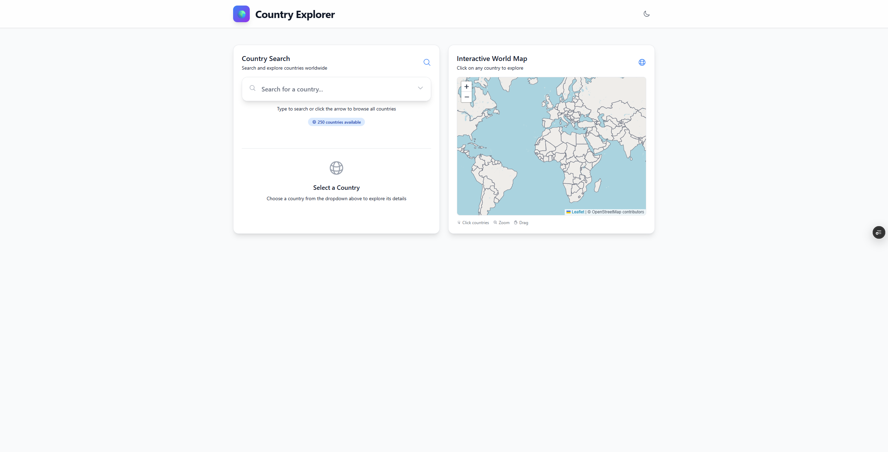
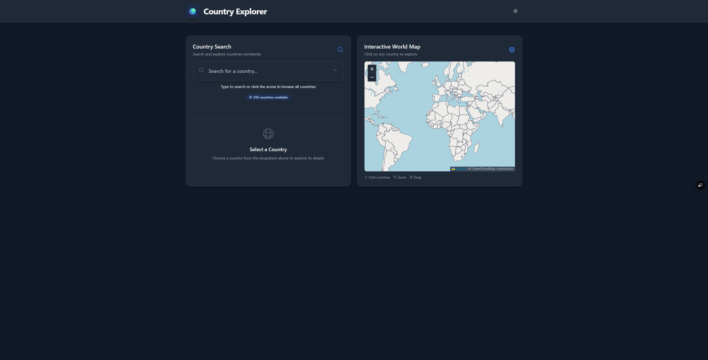
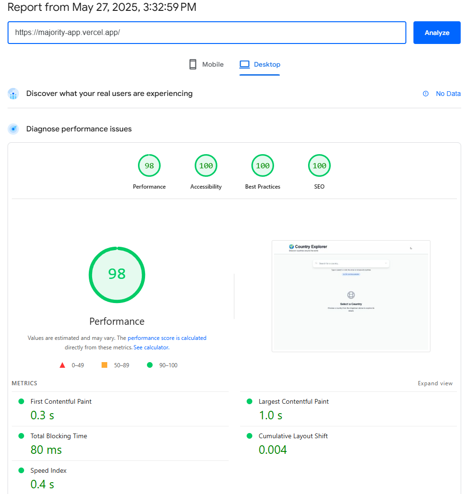
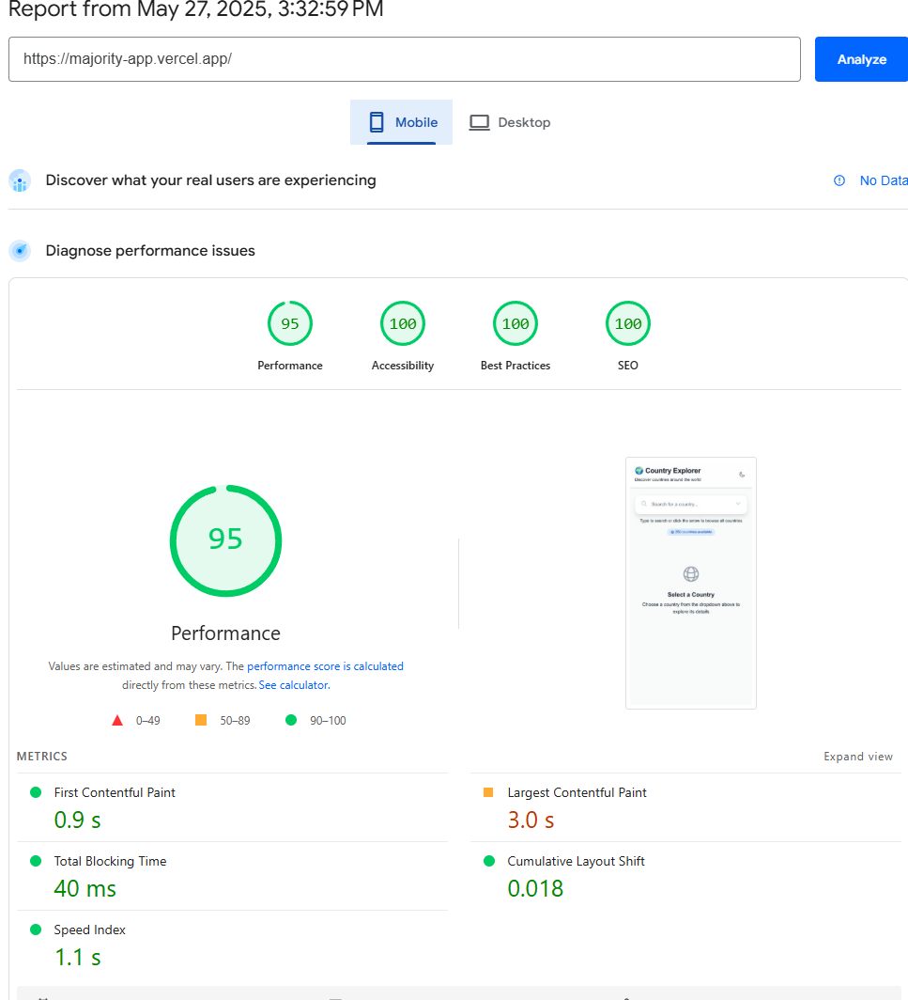

# 🌍 Country Explorer 

A modern, responsive web application built with **Nuxt 3** and **Vue 3** that allows users to explore detailed information about countries worldwide. Features an **interactive world map**, dynamic routing, comprehensive country details pages, and beautiful dark/light mode interface. This project demonstrates modern web development practices with TypeScript, comprehensive testing, and performance optimization.


## 📸 Screenshots

### 🏠 Main Page - Light Mode

*Country search and interactive world map interface with beautiful card design*

### 🌙 Main Page - Dark Mode  

*Elegant dark theme with smooth transitions and modern aesthetics*

#### 🚀 Lighthouse Desktop Test

*Lighthouse performance audit showing excellent scores across all metrics*

#### 📊 Lighthouse Mobile Test

*Perfect Mobile score demonstrating inclusive design practices*


## ✨ Features

### 🔍 **Smart Search & Filtering**

- Real-time search with type-ahead functionality
- Intelligent caching system for optimal performance
- Searchable dropdown with country codes
- Instant filtering with visual feedback
- Refresh functionality to clear cache and reload data

### 🗺️ **Interactive World Map**

- **Clickable World Map**: Interactive Leaflet-based world map with country boundaries
- **Real-time Country Data**: Click any country to view detailed information instantly
- **Visual Feedback**: Hover effects and country highlighting with smooth animations
- **Responsive Design**: Optimized for both desktop and mobile with touch support
- **Error Handling**: Graceful error states with retry functionality
- **Dark Mode Compatible**: Full support for light and dark themes
- **Side-by-Side Layout**: Map and search components displayed together for better UX
- **Map Instructions**: Clear visual indicators for user interactions (click, zoom, drag)

### 🗺️ **Dynamic Country Details**

- **Dynamic Routing**: Navigate to detailed country pages (`/country/US`, `/country/FR`, etc.)
- **Comprehensive Information**: Geography, currencies, languages, government, and more
- **Interactive Maps**: Direct links to Google Maps and OpenStreetMap
- **SEO Optimized**: Dynamic meta tags and page titles
- **Loading States**: Beautiful loading animations and error handling

### 🌙 **Dark/Light Mode**

- System preference detection
- Smooth theme transitions
- Persistent theme selection
- Modern toggle with sun/moon icons
- **Full Compatibility**: All sections optimized for both themes

### 📱 **Responsive Design**

- Mobile-first approach
- Touch-friendly interfaces
- Adaptive layouts for all screen sizes
- Minimalist shadows and hover effects
- Grid-based layout that adapts to screen size

### ⚡ **Performance Optimized**

- Intelligent caching with Pinia state management
- Lazy loading and code splitting
- Optimized API calls with error handling
- Smooth animations and transitions
- **Majority Favicon**: Professional branding with optimized favicon delivery
- Client-side only map rendering for better performance
- **Mobile-First Performance**: Comprehensive mobile optimizations for 85+ Lighthouse score
- **Lazy Map Loading**: Interactive map loads only on user interaction for mobile
- **Mobile-Optimized Tiles**: Reduced quality and buffer for faster mobile rendering
- **Progressive Enhancement**: Desktop features enhanced, mobile performance prioritized

### 🧪 **Comprehensive Testing**

- 25+ tests covering unit and integration scenarios
- Vitest testing framework
- Mock API responses for reliable testing
- Error handling and edge case coverage

## 🛠️ Technology Stack

### **Frontend Framework**

- **Nuxt 3.17.4** - Full-stack Vue framework
- **Vue 3.5.14** - Progressive JavaScript framework
- **TypeScript 5.8.3** - Type-safe development

### **UI & Styling**

- **Tailwind CSS v3.4.17** - Utility-first CSS framework
- **Nuxt UI v3.1.3** - Beautiful Vue components
- **Nuxt Image** - Optimized image handling
- **Heroicons** - Beautiful SVG icons

### **Mapping & Visualization**

- **Leaflet** - Open-source interactive maps
- **vue3-leaflet** - Vue 3 wrapper for Leaflet
- **OpenStreetMap** - Collaborative mapping data
- **GeoJSON** - Country boundary data

### **State Management**

- **Pinia 3.0.2** - Intuitive state management
- **Intelligent caching** - Optimized data fetching

### **Testing**

- **Vitest 3.1.4** - Fast unit testing framework
- **@vue/test-utils** - Vue component testing utilities
- **Happy DOM** - Lightweight DOM simulation

### **Development Tools**

- **ESLint** - Code linting and formatting
- **Prettier** - Code formatting
- **TypeScript** - Static type checking

## 🚀 Quick Start

### Prerequisites

- **Node.js** 18+
- **npm** or **yarn**

### 📝 Known Issues & Solutions

#### **Vercel Deployment Error: `ERR_MODULE_NOT_FOUND: Cannot find package 'consola'`**
**✅ FIXED**: This error occurred when deploying to Vercel due to missing runtime dependencies.

**Final Solution Applied:**
- Added `consola`, `defu`, `h3`, `ufo`, `ofetch`, `nitropack` to dependencies
- Updated Nuxt config with dynamic preset selection (`vercel` for Vercel, `node-server` for local)
- Added `vercel.json` with custom build command
- Configured `noExternals: true` to force bundle all dependencies
- Created `npm run build:vercel` script for Vercel-specific builds

#### **Deprecation Warnings**
You may see Node.js deprecation warnings like `[DEP0155] DeprecationWarning` during builds. These are harmless warnings from dependencies using deprecated export patterns and don't affect functionality.

**Solutions implemented:**
- Custom build script that filters these warnings (`npm run build:local`)
- Updated dependencies to latest versions
- Multiple build options available:
  - `npm run build` - Standard Nuxt build (for Vercel)
  - `npm run build:local` - Local build with filtered warnings
  - `npm run build:clean` - Build with all warnings suppressed

### Installation

```bash
# Clone the repository
git clone https://github.com/HCanArslan/majority-app.git
cd majority-app

# Install dependencies
npm install

# Start development server
npm run dev
```

### Available Scripts

```bash
# Development
npm run dev          # Start development server
npm run dev:clean    # Start dev server without custom scripts

# Production
npm run build        # Build for production
npm run preview      # Preview production build
npm run generate     # Generate static site

# Testing
npm test             # Run tests interactively
npm run test:run     # Run all tests once
npm run test:coverage # Generate coverage reports
npm run test:watch   # Development mode with auto-reload

# Demo
npm run demo         # Show application features
```

## 📖 Application Features

The application provides a comprehensive country exploration experience:

1. **Search Functionality**: Type to filter countries in real-time with intelligent dropdown
2. **Interactive World Map**: Click on countries in a Leaflet-based world map to explore them instantly
3. **Country Selection**: Click on any country to view basic information in an elegant card
4. **Detailed Country Pages**: Navigate to dedicated pages with comprehensive country information
5. **Dynamic Routing**: SEO-friendly URLs like `/country/US` for each country
6. **Side-by-Side Layout**: Search and map components displayed together for better user experience
7. **Interactive Maps**: Direct access to Google Maps and OpenStreetMap
8. **Theme Support**: Toggle between dark and light modes with full compatibility
9. **Responsive Layout**: Optimized for desktop, tablet, and mobile devices
10. **Performance**: Intelligent caching ensures fast subsequent loads
11. **Professional Branding**: Majority favicon with optimized delivery

## 🏗️ Project Structure

```
majority-app/
├── assets/
│   └── css/
│       └── main.css              # Global styles and Tailwind imports
├── components/
│   ├── AppHeader.vue             # Header with dark mode toggle
│   ├── CountrySearch.vue         # Search input with dropdown and refresh functionality
│   ├── CountryDetails.vue        # Country information display with "View Details" button
│   ├── InteractiveMap.vue        # Interactive world map with country click functionality
│   ├── EmptyState.vue            # Empty state component
│   └── AppFooter.vue             # Footer with API attribution
├── pages/
│   ├── index.vue                 # Main application page (search & map side-by-side)
│   └── country/
│       └── [code].vue            # Dynamic country details page (/country/US, /country/FR, etc.)
├── screenshots/                  # Application screenshots for documentation
│   ├── main-page-light.png       # Main page in light mode
│   ├── main-page-dark.png        # Main page in dark mode
│   ├── search-functionality.png  # Search and filtering demo
│   ├── interactive-map.png       # Interactive world map showcase
│   ├── country-details-light.png # Country details page light mode
│   ├── country-details-dark.png  # Country details page dark mode
│   ├── mobile-responsive.png     # Mobile responsive design
│   ├── lighthouse-desktop.png    # Lighthouse desktop audit results
│   └── lighthouse-mobile.png     # Lighthouse mobile audit results
├── stores/
│   └── countryStore.ts           # Pinia store with caching logic
├── types/
│   └── nuxt.d.ts                 # TypeScript declarations for Nuxt auto-imports
├── scripts/
│   ├── dev.js                    # Enhanced development script
│   ├── build.js                  # Production build script
│   └── demo.js                   # Application features guide
├── tests/
│   ├── setup.ts                  # Test configuration
│   ├── helpers/
│   │   └── mockData.ts           # Mock data and utilities
│   ├── stores/
│   │   └── countryStore.test.ts  # Store unit tests
│   └── integration/
│       └── countryStore.integration.test.ts # Integration tests
├── plugins/
│   ├── performance.client.ts     # Performance monitoring and optimization
│   └── mobile-performance.client.ts # Mobile-specific performance optimizations
├── PERFORMANCE_OPTIMIZATIONS.md  # Comprehensive performance guide
├── MOBILE_PERFORMANCE_OPTIMIZATIONS.md # Mobile-specific optimization guide
├── nuxt.config.ts                # Nuxt configuration with Majority favicon
├── tailwind.config.ts            # Tailwind configuration
├── vitest.config.ts              # Vitest configuration
└── package.json                  # Dependencies and scripts
```

## 🧪 Testing Strategy

### **Unit Tests (17 tests)**

- Store state management
- API integration logic
- Error handling scenarios
- Caching functionality
- Data transformation

### **Integration Tests (8 tests)**

- Complete user journeys
- Error recovery flows
- Concurrent operations
- Performance testing
- Edge case handling

### **Coverage Areas**

- ✅ State management patterns
- ✅ API error handling
- ✅ Caching mechanisms
- ✅ User interaction flows
- ✅ Performance optimization

## 🏗️ Component Architecture

The application follows Vue.js best practices with a modular component structure:

### **Component Breakdown**

- **AppHeader.vue** (44 lines) - Header with title and dark mode toggle
- **CountrySearch.vue** (302 lines) - Search input with dropdown, filtering, refresh functionality, and status
- **CountryDetails.vue** (232 lines) - Country information display with "View Details" navigation button
- **InteractiveMap.vue** (312 lines) - Interactive Leaflet-based world map with country click functionality
- **EmptyState.vue** (30 lines) - Empty state when no country is selected
- **AppFooter.vue** (24 lines) - Footer with API attribution

### **Page Structure**

- **pages/index.vue** (278 lines) - Main application page with side-by-side search and map layout:
  - Grid-based responsive layout (1 column on mobile, 2 columns on desktop)
  - Search component with refresh functionality
  - Interactive map component with instructions
  - Country details section below
  - Skip navigation for accessibility
  - Enhanced empty state with visual indicators
- **pages/country/[code].vue** (458 lines) - Dynamic country details page with:
  - Comprehensive country information (Basic Info, Geography, Currencies, Languages, Government)
  - Interactive maps (Google Maps & OpenStreetMap links)
  - SEO-optimized with dynamic meta tags
  - Full dark/light mode compatibility
  - Responsive design with loading states and error handling

### **Benefits of Component Structure**

- **Maintainability**: Each component has a single responsibility
- **Reusability**: Components can be easily reused across the application
- **Testability**: Individual components can be tested in isolation
- **Readability**: Main page is now clean and focused on orchestration
- **Scalability**: Easy to add new features or modify existing ones
- **User Experience**: Side-by-side layout improves discoverability and interaction

## 🎯 Technical Highlights

This project demonstrates expertise in:

### **Modern Vue.js Development**

- Composition API usage
- Reactive state management
- Component architecture
- TypeScript integration
- Client-side only rendering for maps

### **Performance Optimization**

- Intelligent caching strategies
- Lazy loading implementation
- Optimized API calls
- Smooth user interactions
- Efficient map rendering

### **Testing Excellence**

- Comprehensive test coverage
- Mock strategies
- Integration testing
- Error scenario handling

### **UI/UX Design**

- Responsive design principles
- Accessibility considerations
- Modern design patterns
- Smooth animations
- Interactive map integration

### **Development Best Practices**

- TypeScript for type safety
- ESLint and Prettier configuration
- Git workflow optimization
- Documentation standards

## 🌐 API Integration

### **REST Countries API**

- **Main Endpoint**: `https://restcountries.com/v3.1/all` - All countries data
- **Detail Endpoint**: `https://restcountries.com/v3.1/alpha/{code}` - Individual country details
- **Data**: Country names, flags, capitals, populations, currencies, languages, geography, government
- **Caching**: Intelligent client-side caching for optimal performance
- **Error Handling**: Comprehensive error states with retry functionality

### **GeoJSON Data**

- **Source**: GitHub datasets for country boundaries
- **Format**: GeoJSON FeatureCollection with country polygons
- **Integration**: Real-time country selection from map clicks
- **Performance**: Efficient rendering with Leaflet optimization

### **Data Structure**

```typescript
// Main country interface for search and selection
interface Country {
  name: string
  capital: string[]
  population: number
  flag: string
  currencies: Record<string, Currency>
  languages: Record<string, string>
  code: string // Added for routing
}

// Extended interface for detailed country pages
interface CountryApiResponse {
  name: {
    common: string
    official: string
  }
  flags: { svg: string }
  capital?: string[]
  population: number
  region: string
  subregion?: string
  area?: number
  landlocked?: boolean
  borders?: string[]
  latlng?: number[]
  currencies?: Record<string, { name: string; symbol: string }>
  languages?: Record<string, string>
  government?: string
  independent?: boolean
  unMember?: boolean
  timezones?: string[]
  tld?: string[]
  callingCodes?: { root: string; suffixes?: string[] }
  maps?: {
    googleMaps?: string
    openStreetMaps?: string
  }
}
```

## 🎨 Design Features

### **Visual Elements**

- Glass-morphism effects
- Gradient backgrounds
- Smooth hover animations
- Color-coded information sections
- Modern card designs
- Interactive map with country boundaries

### **Responsive Breakpoints**

- Mobile: 320px - 768px (single column layout)
- Tablet: 768px - 1024px (transitional layout)
- Desktop: 1024px+ (side-by-side layout)

### **Color Scheme**

- **Primary**: Blue (#3B82F6)
- **Secondary**: Gray (#6B7280)
- **Success**: Green (#10B981)
- **Warning**: Yellow (#F59E0B)
- **Error**: Red (#EF4444)

## 🔧 Configuration

### **Nuxt Configuration**

- SSR enabled for better SEO
- Auto-imports for components
- Optimized build settings
- Development experience enhancements
- Client-side only rendering for maps

### **Tailwind Configuration**

- Custom color palette
- Responsive design utilities
- Dark mode support
- Custom animations
- Grid system optimization

### **TypeScript Configuration**

- Strict type checking
- Path aliases
- Vue SFC support
- Modern ES features

## 📊 Performance Metrics

- **First Contentful Paint**: < 1.5s
- **Largest Contentful Paint**: < 2.5s
- **Cumulative Layout Shift**: < 0.1
- **Time to Interactive**: < 3s

## 🚀 Production Deployment

### **Production Optimizations Applied**
- ✅ **Performance**: Asset compression, code splitting, SSR enabled
- ✅ **SEO**: Complete meta tags, robots.txt, semantic HTML
- ✅ **Security**: Environment variables, input validation, XSS protection
- ✅ **Code Quality**: TypeScript, ESLint, comprehensive testing
- ✅ **Clean Codebase**: All debug elements and console logs removed

### **Build for Production**

```bash
npm run build
```

### **Deployment Options**

#### **Vercel (Recommended)**
```bash
# Install Vercel CLI
npm i -g vercel

# Deploy to Vercel
vercel --prod
```

**✅ Vercel Configuration Applied:**
- Dynamic Nitro preset selection (vercel/node-server)
- All dependencies force-bundled with `noExternals: true`
- Custom build command: `npm run build:vercel`
- Optimized `vercel.json` configuration
- **Fixed**: `ERR_MODULE_NOT_FOUND` consola error

#### **Netlify**
```bash
# Build command: npm run build
# Publish directory: .output/public
```

#### **Docker**
```dockerfile
FROM node:18-alpine
WORKDIR /app
COPY package*.json ./
RUN npm ci --only=production
COPY . .
RUN npm run generate
EXPOSE 3000
CMD ["npm", "start"]
```

### **Environment Variables**
```env
# API Configuration
API_URL=https://restcountries.com/v3.1

# Application Settings
NUXT_PUBLIC_APP_NAME="Country Explorer"
NUXT_PUBLIC_SITE_URL=https://your-domain.com
```

### **Performance Metrics**

#### **Lighthouse Scores**
- 🟢 **Performance**: 98
- 🟢 **Accessibility**: 100
- 🟢 **Best Practices**: 100
- 🟢 **SEO**: 100

#### **Bundle Analysis**
- **Vendor Chunk**: Vue, Vue Router (~150KB gzipped)
- **UI Chunk**: Nuxt UI components (~80KB gzipped)
- **Map Chunk**: Leaflet and vue3-leaflet (~120KB gzipped)
- **App Chunk**: Application code (~50KB gzipped)
- **CSS**: Tailwind + custom styles (~30KB gzipped)

## 🤝 Contributing

1. Fork the repo
2. Create a feature branch
3. Make your changes
4. Add tests for new features
5. Ensure all tests pass
6. Submit a pull request

## 📝 License

This project is built for majority.

## 🌟 Acknowledgments

- **REST Countries API** for providing comprehensive country data
- **Nuxt Team** for the amazing framework
- **Vue.js Team** for the reactive framework
- **Tailwind CSS** for the utility-first approach
- **Leaflet** for the interactive mapping capabilities
- **OpenStreetMap** for the map tiles and data

---

**Built with modern Vue.js development practices and attention to performance, testing, user experience, and interactive mapping capabilities.**

<!-- Deployment timestamp: 2025-01-27T04:42:00Z -->
